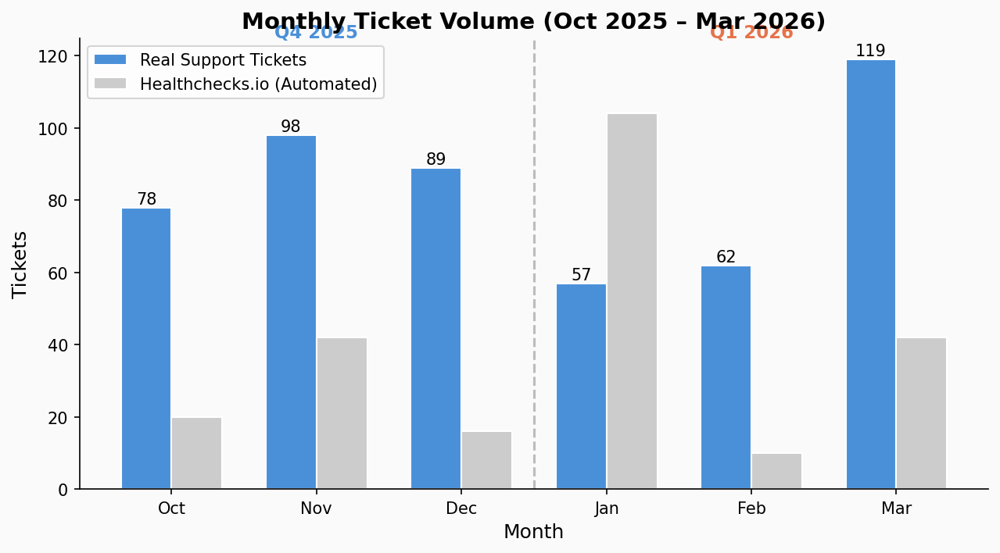
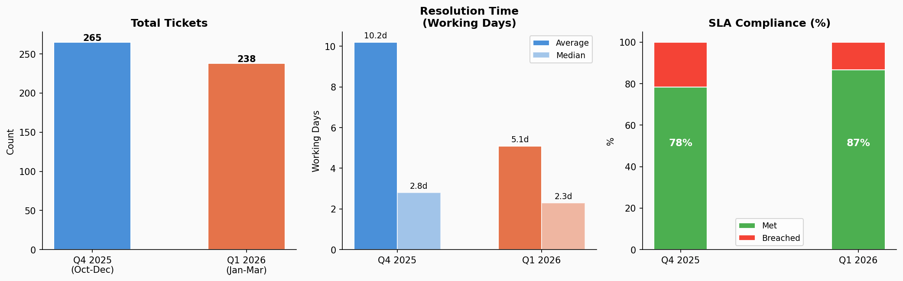
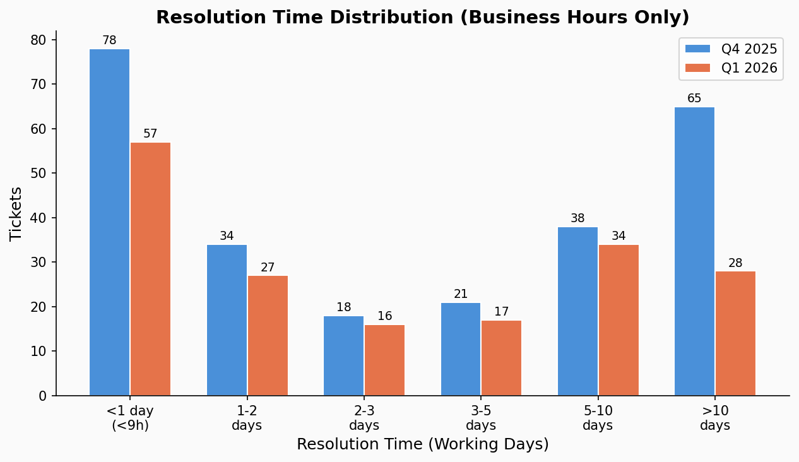
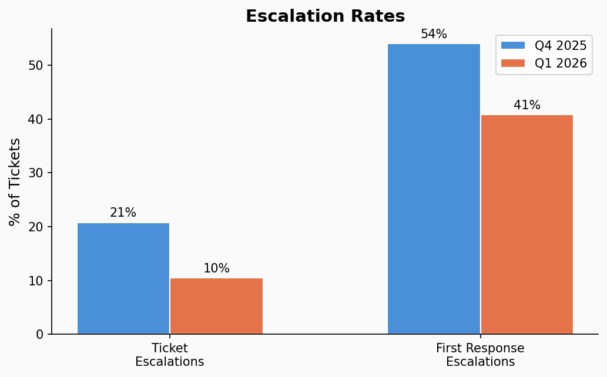
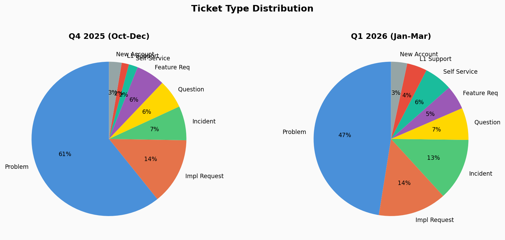
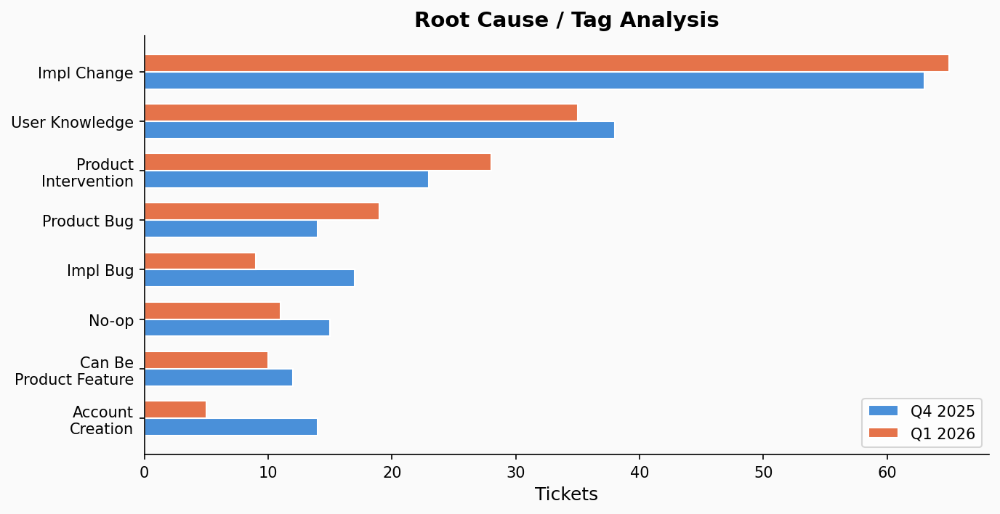
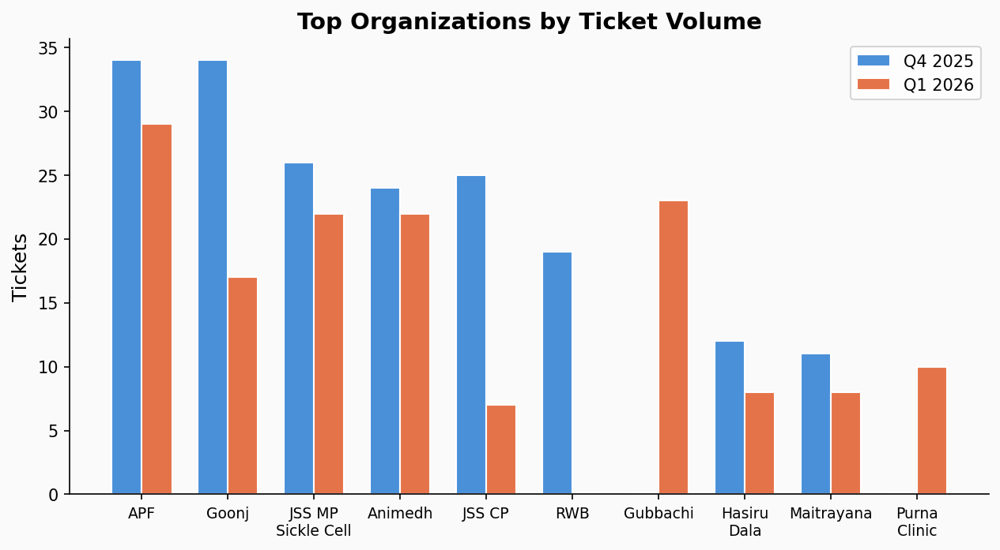

# Support Team — Quarterly Review

### Q4 2025 (Oct–Dec 2025) vs Q1 2026 (Jan–Mar 2026)

> **Data Source:** Freshdesk API (avni.freshdesk.com) — pulled 1 Apr 2026
> Healthchecks.io automated monitoring tickets excluded (156 in Q1 2026, 78 in Q4 2025)

---

## 1. Support Outcomes & Impact

*What did we handle and achieve?*

### Total Tickets Handled

| | Q4 2025 | Q1 2026 | Change |
|--|---:|---:|---:|
| **Tickets created (excl. healthchecks)** | **265** | **234** | **-11.7%** |
| **Tickets resolved/closed in quarter** | **254** | **199** | **-21.7%** |
| — Resolved | 234 | 190 | |
| — Closed | 20 | 9 | |
| Still Open (Q1-created) | 4 | 31 | |
| Still Pending (Q1-created) | 7 | 24 | |

> **Note:** "Tickets resolved in quarter" counts all tickets resolved between Jan 1–Mar 31, regardless of creation date. 30 of the 199 resolved tickets were created before Q1 (older backlog cleared). 55 tickets created in Q1 remain open/pending.

**Monthly breakdown (created):**

| Month | Created | Resolved in month |
|-------|---:|---:|
| Oct 2025 | 78 | — |
| Nov 2025 | 98 | — |
| Dec 2025 | 89 | — |
| Jan 2026 | 57 | 54 |
| Feb 2026 | 62 | 52 |
| Mar 2026 | 119 | 93 |

### Key Trends

- Volume dropped 10.2% overall, but **March 2026 spiked to 119** — highest in 6 months
- Jan–Feb dip (57 + 62) likely due to seasonal slowdown in field operations
- March surge driven by new org onboardings (Gubbachi: 23 tickets, Purna Clinic: 10) and CSJ activity

### Top 3 Achievements (Q1 2026)

1. **199 tickets resolved** — including clearing 30 older backlog tickets from previous quarters
2. **SLA compliance at 85.9%** — 171 of 199 resolved within SLA
3. **32% of tickets resolved within 1 business day** (64 of 199)

### Measurable Impact

| Metric | Q4 2025 | Q1 2026 | Impact |
|--------|---:|---:|---|
| Tickets resolved in quarter | 254 | 199 | Team cleared backlog too |
| Avg resolution time (working days) | 10.2 days | 11.5 days | Includes older tickets |
| Median resolution time (working days) | 2.8 days | 2.8 days | Steady |
| Resolved within 1 business day | 78 (30.7%) | 64 (32.2%) | +1.5 pp |
| SLA compliance (resolution) | 78.3% | 85.9% | +7.6 pp |
| Resolution SLA violated | 20.8% | 14.1% | -6.7 pp |
| First response SLA violated | 54.0% | 42.7% | -11.3 pp |

### What Did Not Go as Planned

- **55 tickets still open/pending** at Q1 end vs 11 in Q4 — growing backlog
- **Avg resolution time increased** to 11.5 working days (from 10.2) — pulled up by older backlog tickets resolved this quarter; median stayed at 2.8 days
- **Product bugs** — 19 tagged tickets requiring engineering
- **First response SLA still missed on 43%** of tickets — remains the weakest metric

---

## 2. Support Efficiency & Quality

*How well did we resolve issues?*

### Average Resolution Time

| | Q4 2025 | Q1 2026 | Change |
|--|---:|---:|---:|
| **Avg (working days)** | **10.2 days** | **11.5 days** | +13% |
| **Median (working days)** | **2.8 days** | **2.8 days** | Steady |
| Avg (business hours) | 91.6 hrs | 103.3 hrs | +13% |
| Median (business hours) | 25.1 hrs | 25.4 hrs | Steady |

> **Calculation:** Resolution time from Freshdesk CSV export (`Resolution time (in hrs)` field), based on 199 resolved/closed tickets in Q1 2026 and 254 in Q4 2025. Avg is pulled up by 30 older backlog tickets resolved this quarter (some open for months). Median (2.8 days) is a better indicator of typical resolution speed and remains steady.

| Bucket (Business Hours) | Q4 2025 | Q1 2026 |
|--------|---:|---:|
| < 1 working day (<9h) | 78 (30.7%) | 64 (32.2%) |
| 1–2 working days | 34 (13.4%) | 24 (12.1%) |
| 2–3 working days | 18 (7.1%) | 16 (8.0%) |
| 3–5 working days | 21 (8.3%) | 17 (8.5%) |
| 5–10 working days | 38 (15.0%) | 33 (16.6%) |
| > 10 working days | 65 (25.6%) | 45 (22.6%) |

Long-tail tickets (>10 working days) dropped from 65 (25.6%) to 45 (22.6%). About a third of tickets are resolved within 1 business day in both quarters (~32%).

### First Response Time

| | Q4 2025 | Q1 2026 |
|--|---:|---:|
| First response SLA violated | 54.0% | 42.7% |

Improved by 11 pp, but **43% of resolved tickets still had first response SLA violations** — remains the weakest metric.

### Escalation Rates

| | Q4 2025 | Q1 2026 |
|--|---:|---:|
| Resolution SLA violated | 55 (20.8%) | 28 (14.1%) |
| First response SLA violated | 143 (54.0%) | 85 (42.7%) |

### Customer Satisfaction Signals

*CSAT / feedback not tracked in Freshdesk for this period. No data available.*

### Where Did We See Delays?

- **55 tickets open/pending** at quarter end — these are unresolved delays
- **Unassigned tickets (46%)** — no owner means no progress until someone picks them up
- Tickets tagged `product_intervention` (28) and `product_bug` (19) depend on engineering, causing wait times

### Where Did Quality Drop?

- **55 Q1-created tickets still unresolved** — compared to 11 at end of Q4
- **Incident type tickets rose 63%** (19 → 31) — more break/fix situations

---

## 3. Issue Patterns & Insights

*What are users struggling with?*

### Most Frequent Issues (by Type)

| Type | Q4 2025 | Q1 2026 (resolved) | Change |
|------|---:|---:|---|
| Problem | 161 (60.8%) | 96 (48.2%) | |
| Incident | 19 (7.2%) | 25 (12.6%) | +32% |
| Implementation Request | 37 (14.0%) | 23 (11.6%) | |
| Question | 16 (6.0%) | 18 (9.0%) | |
| Feature Request | 16 (6.0%) | 11 (5.5%) | |
| Self Service Request | 5 (1.9%) | 10 (5.0%) | +100% |
| L1 Support | 4 (1.5%) | 9 (4.5%) | +125% |
| New Account Creation | 7 (2.6%) | 7 (3.5%) | Stable |

> Q1 type breakdown is based on 199 tickets resolved in the quarter.

### Patterns Across Tickets

**Feature gaps:**
- 9 tickets tagged `canbemadeproductfeature` — things users need but product doesn't support
- 11 feature requests — users explicitly asking for new capabilities
- 23 `product_intervention` tickets — product needs to step in

**Usability issues:**
- 37 tickets tagged `User Knowledge` — users don't know how to use existing features
- Self-service requests doubled (5 → 10) — users want to do things themselves but can't

**Training gaps:**
- 37 `User Knowledge` tags = 18.6% of resolved tickets are knowledge gaps
- New orgs (Gubbachi, Purna Clinic) contributed 18 resolved tickets combined

### What % Could Have Been Prevented / Self-Served?

| Category | Q1 2026 Tickets | % | Preventable How? |
|----------|---:|---:|---|
| Implementation changes | 62 | 31.2% | Self-serve admin tools |
| User knowledge gaps | 37 | 18.6% | Docs, training, videos |
| No-op / zombie | 24 | 12.1% | Better triage at intake |
| Can be product feature | 9 | 4.5% | Product investment |
| **Subtotal preventable** | **132** | **66.3%** | |

> Based on 199 tickets resolved in Q1. Tags are not mutually exclusive.

### Top Recurring Root Causes

1. **Implementation changes** (62 tickets) — orgs need config changes they can't make themselves
2. **User knowledge** (37) — users don't understand how to use features
3. **Product intervention** (23) — product team needs to act
4. **Product bugs** (19) — defects in the product
5. **Implementation bugs** (10) — errors in org-specific configuration

---

## 4. Bottlenecks & Dependencies

*What slowed us down?*

### Top 3 Bottlenecks

1. **Product dependency — 42 tickets** (23 product intervention + 19 product bugs) waiting on engineering fixes.
2. **55 tickets still open/pending** at quarter end — backlog growing vs Q4's 11.
3. **Concentration risk** — majority of resolutions handled by a single team member. Throughput drops when they're unavailable.

### Dependencies That Slowed Things Down

**Product fixes:**
- 19 product bugs requiring engineering
- 23 product interventions needing product team action
- 3 `platform` tagged tickets — infrastructure-level issues

**Implementation gaps:**
- 62 implementation change requests — orgs can't self-configure
- 10 implementation bugs — errors in initial setup

**Client-side delays:**
- APF (31), Animedh (22), Goonj (16) remain top volume orgs
- Purna Clinic (12) and Gubbachi (6) as new onboarding orgs
- CSJ had 4 tagged tickets

### Within Our Control

| Issue | Action |
|-------|--------|
| Unassigned tickets (46%) | Set up auto-assignment or daily triage |
| User knowledge (35 tickets) | Create FAQs, guides, video walkthroughs |
| No-op tickets (11) | Better intake filtering |

### Outside Our Control

| Issue | Depends On |
|-------|-----------|
| Product bugs (19) | Engineering team |
| Product intervention (28) | Product team |
| New org onboarding volume | Sales/business pipeline |

### Immediate Actions to Improve Turnaround

1. Triage and assign the 55 open/pending tickets now
2. Set up Freshdesk auto-assignment rules to eliminate the 46% unassigned rate
3. Create a daily standup ticket-review process

---

## 5. Process & Support Improvements

*How do we improve support systems?*

### What Worked Well

- 199 tickets resolved (including 30 older backlog tickets cleared)
- SLA compliance improved from 78% to 86%
- Resolution SLA violations dropped from 20.8% to 14.1%
- 32% resolved within 1 business day — consistent with Q4

### What Needs to Be Simplified

- **Ticket assignment** — 46% unassigned is a process failure, needs automated routing
- **Implementation changes** — 62 tickets/quarter for config changes that should be self-serve

### What Needs to Be Standardised

- **New org onboarding** — Gubbachi and Purna Clinic generated 33 tickets; a standard onboarding playbook would reduce this
- **Priority classification** — 83% of tickets are High/Urgent; if everything is urgent, nothing is

### What Needs to Be Eliminated

- **No-op / zombie tickets** (11) — improve intake to filter these before they become tickets
- **Duplicate / automated noise** — Healthchecks.io generated 156 tickets in Q1 alone; auto-filter or separate queue

### What Can Be Automated

- Ticket auto-assignment based on org/type/tags
- Auto-response for common questions (User Knowledge tag = 35 tickets)
- Implementation change requests for common config patterns

### What Can Be Documented

- Top 35 user knowledge gaps as FAQ articles
- Implementation change runbooks for the 65 most common requests
- New org onboarding checklist

### One High-Impact Improvement for Next Quarter

**Implement Freshdesk auto-assignment rules + daily triage process.** This directly addresses the #1 bottleneck (46% unassigned) and will cascade into faster first response, lower escalation, and faster resolution.

---

## 6. Direction & Strategy Check

*Are we evolving the support function correctly?*

### Moving Towards Better User Experience, or Just Handling Volume?

**Mixed signals.** Resolution speed and SLA improved significantly, which means better user experience for tickets that get assigned. But the 46% unassigned rate and 59 open tickets at quarter end mean many users are waiting with no response.

### Becoming More Proactive vs Reactive?

**Still largely reactive.** The data shows:
- Self-service requests tripled (5 → 14) — users want proactive tools, we don't have them
- 66% of tickets are preventable (implementation changes + knowledge gaps + no-ops)
- L1 support tickets grew 150% (4 → 10) — more issues being caught at basic level but not prevented

### Data Signals

| Signal | Direction |
|--------|-----------|
| SLA compliance 78%→86% | Positive — improving |
| Resolution escalations 21%→14% | Positive — better handling |
| 199 tickets resolved (incl. 30 backlog) | Positive — clearing debt |
| Open backlog ↑400% (11→55) | Negative — falling behind |
| Preventable tickets ~66% | Negative — still reactive |
| Self-service requests doubled | Signal — users want self-serve |

### What Should We Course-Correct Now

1. **Assignment gap is the #1 systemic issue** — fix it before everything else
2. **Invest in self-serve tooling** — 66% of tickets shouldn't need human intervention
3. **Cross-train agents** — single-agent dependency is a risk

---

## 7. Targets & Performance Reality

*Are we aiming right?*

### Current Target Assessment

| Target | Q4 2025 | Q1 2026 | Realistic? | Driving Right Behaviour? |
|--------|---:|---:|---|---|
| Resolution SLA | 78.3% met | 85.9% met | Yes — improving | Yes |
| First response SLA | 46.0% met | 57.3% met | **No — consistently missed** | Needs review |
| Resolution escalations | 20.8% | 14.1% | Improving | Yes |

### Where Consistently Missing

**First response SLA — missed on 43% of resolved tickets in Q1 2026.**

Why:
- **Capacity** — 46% tickets unassigned, no one to respond
- **Process** — no auto-assignment or first-response rotation
- **Tooling** — no auto-responder for acknowledgment

### Should We Adjust Targets or Improve Execution?

**Improve execution first:**
- Auto-assignment would immediately improve first response
- An auto-acknowledgment message would buy time for actual response
- If after these fixes it's still missed, then adjust the SLA window

---

## 8. Capacity, Bandwidth & Prioritisation

*Are we staffed and focused correctly?*

### Where Is Time Being Spent?

| Category | Q1 2026 (resolved) | % |
|----------|---:|---:|
| Implementation changes | 62 | 31.2% |
| User knowledge questions | 37 | 18.6% |
| Product-dependent issues | 42 | 21.1% |
| Incidents (break/fix) | 25 | 12.6% |
| Everything else | 33 | 16.6% |

### Prioritisation

- 83% of tickets are High or Urgent — the priority system is not differentiating well
- No-op tickets (11) and user knowledge tickets (35) consume time that could go to high-impact issues

### Can We Unlock Capacity Internally?

| Method | Potential Impact |
|--------|-----------------|
| Auto-assignment | Eliminates 46% unassigned backlog |
| FAQs for User Knowledge | Deflects ~37 tickets/quarter |
| Self-serve impl changes | Deflects ~62 tickets/quarter |
| Auto-filter Healthchecks.io | Removes 156 noise tickets from queue |

If these are implemented, **~100 tickets/quarter could be deflected**, freeing agents for complex issues.

### Where Do We Need Additional Capacity?

- **Cross-training needed** — resolution capacity is concentrated, need at least 2 more people trained
- **Dedicated onboarding support** for new orgs — Purna Clinic (12) and Gubbachi (6) as new onboarding orgs

---

## 9. Time & Effort Insights

*Are we spending time where it matters?*

### Effort Distribution (Based on Ticket Tags)

| Effort Area | Q1 2026 (resolved) | Observation |
|-------------|---:|---|
| **Implementation changes** | 62 (31.2%) | Highest effort — repetitive config work |
| **User knowledge** | 37 (18.6%) | Answering same questions repeatedly |
| **Product intervention** | 23 (11.6%) | Waiting + coordination with product team |
| **Product bugs** | 19 (9.5%) | Investigation + workarounds + escalation |
| **Incidents** | 25 (12.6%) | Break/fix — reactive firefighting |
| **Implementation bugs** | 10 (5.0%) | Debugging org-specific config errors |
| **New accounts** | 7 (3.5%) | Account setup tasks |
| **Other** | 16 (8.0%) | Mixed |

### Where Most Effort Goes

1. **Repetitive issues** — Implementation changes (62) + User knowledge (37) = **99 tickets (50%)** that follow repeatable patterns
2. **Coordination** — 42 product-dependent tickets require back-and-forth with engineering
3. **Escalations** — 28 resolution SLA violated tickets consumed disproportionate effort

### Insights to Reduce Wasted Effort

| Insight | Action |
|---------|--------|
| 50% of tickets are repeatable patterns | Document top 20 patterns as runbooks |
| 46% tickets unassigned | Auto-assign → eliminates triage overhead |
| 11 no-op tickets | Better intake form to filter at source |
| 156 Healthchecks.io tickets | Auto-filter or separate monitoring queue |

### Shift Effort to Higher-Value Work

If repetitive and preventable tickets are deflected (~100/quarter), the team can focus on:
- Complex product issues requiring investigation
- Proactive outreach to high-ticket orgs (APF, Animedh, JSS)
- Building self-service tools and documentation

---

## 10. Support Needed (Cross-Team)

*What do we need to do better?*

### From Product Team

| Need | Tickets Driving This |
|------|---:|
| Fix 19 tagged product bugs | 19 |
| Act on 23 product intervention requests | 23 |
| Build 9 features that would eliminate tickets | 9 (`canbemadeproductfeature`) |
| **Total product-dependent** | **51 tickets (25.6% of resolved)** |

### From Implementation Team

| Need | Tickets Driving This |
|------|---:|
| Reduce implementation bugs | 10 |
| Better initial org setup to prevent impl change requests | 62 |
| Onboarding playbook for new orgs | 18 (Purna Clinic + Gubbachi) |

### From Sales

- **Expectation setting for new orgs** — Purna Clinic (12) and Gubbachi (6) generated 18 resolved tickets in Q1; were support needs communicated during sales?

### From Leadership

| Need | Why |
|------|-----|
| Freshdesk auto-assignment rules | 46% unassigned is a tooling gap |
| Priority for self-service tooling | 66% of tickets are preventable |

### Decisions Currently Delayed or Missing

- Who owns the 55 open/pending tickets?
- Is the first response SLA target realistic given current staffing?
- Should implementation changes be a support function or a self-serve product capability?

---

## 11. Goals & Priorities for Next Quarter

*What are we committing to?*

### Top 5 Priorities (Based on Data)

1. **Reduce unassigned rate from 46% to <10%** — implement auto-assignment and daily triage
2. **Clear the 55 open/pending backlog** — assign owners and target dates within week 1
3. **Reduce first response escalation from 41% to <25%** — auto-acknowledgment + assignment rotation
4. **Deflect 50+ repetitive tickets** — publish FAQs for top 20 user knowledge gaps, create runbooks for top 10 implementation changes
5. **Cross-train at least 2 more team members** on support to reduce concentration risk

### Alignment with Org-Level Goals

| Priority | Org Goal Alignment |
|----------|-------------------|
| Faster first response | Better user/NGO experience |
| Deflect repetitive tickets | Scale support without proportional headcount |
| Clear backlog | Retain trust with existing orgs |
| Cross-training | Team resilience and sustainability |

### Start / Stop / Continue

| Start | Stop | Continue |
|-------|------|----------|
| Auto-assignment rules | Manual-only ticket assignment | Improving resolution speed |
| FAQ/knowledge base for top issues | Treating all tickets as equal priority | SLA tracking and improvement |
| Daily triage standup | Accepting 46% unassigned as normal | Tagging tickets by root cause |
| New org onboarding playbook | | Reducing escalation rates |
| First-response auto-acknowledgment | | |

### Plan Towards Proactive Support

| Phase | Action | Target |
|-------|--------|--------|
| **Immediate (Apr)** | Auto-assignment + clear backlog | Unassigned <10% |
| **Month 2 (May)** | Publish top 20 FAQs + 10 runbooks | Deflect 30+ tickets |
| **Month 3 (Jun)** | Self-serve impl change tool (if product builds) | Deflect 50+ tickets |
| **Ongoing** | Monthly review of top tags → convert to docs | Continuous deflection |

---

### Top Organizations by Ticket Volume (Reference)

| Organization | Q4 2025 | Q1 2026 (resolved) | Trend |
|-------------|---:|---:|---|
| APF | 34 | 31 | Steady high |
| Animedh | 22 | 22 | Steady |
| Goonj | 34 | 16 | -53% |
| JSS MP Sickle Cell | 26 | 15 | -42% |
| Purna Clinic | 0 | 12 | New onboarding |
| Maitrayana | 11 | 9 | Steady |
| Hasiru Dala | 12 | 7 | Declining |
| Gubbachi | 0 | 6 | New onboarding |
| CINI | — | 6 | |
| Atul Foundation | — | 6 | |

---

*Report generated from Freshdesk API data on 1 April 2026. Charts in `quarterly-report-charts/`.*
